# NiFi + ELK Exercise

- Professor:   [Pedro Nieto](https://github.com/a10pepo)
- Student:      [Carlos Donoso](https://github.com/cadoca1)

```
Usando NiFi + ELK, debéis presentar una solución que muestre, sobre un mapa, la disposición de delitos presentes en esta API:
https://data.cityofnewyork.us/Social-Services/311-Service-Requests-from-2010-to-Present/erm2-nwe9
```

#### Step 1: Prepare a docker-compose file with the following containers.

| Component | Port |
| --- | --- | 
| NiFi | 8080 |
| Elasticsearch | 9200 |
| Kibana | 5601 |

#### Step 2: Use the following processors in NiFi.

```
InvokeHTTP: Call the API.
```
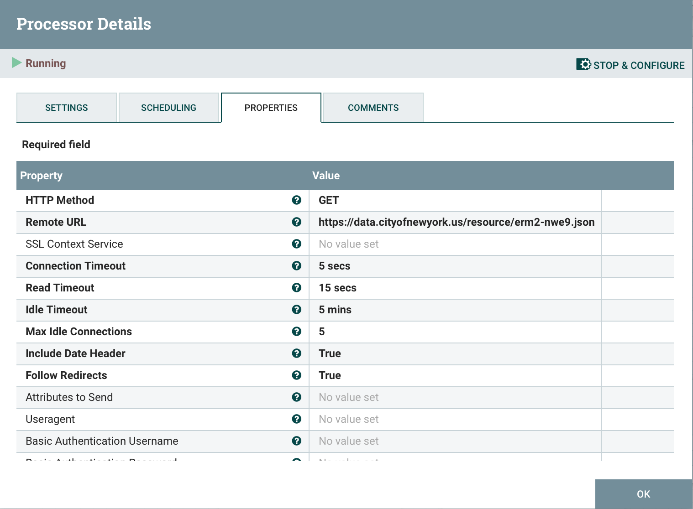

```
SplitJson: Convert the obtained array into separated documents.
```
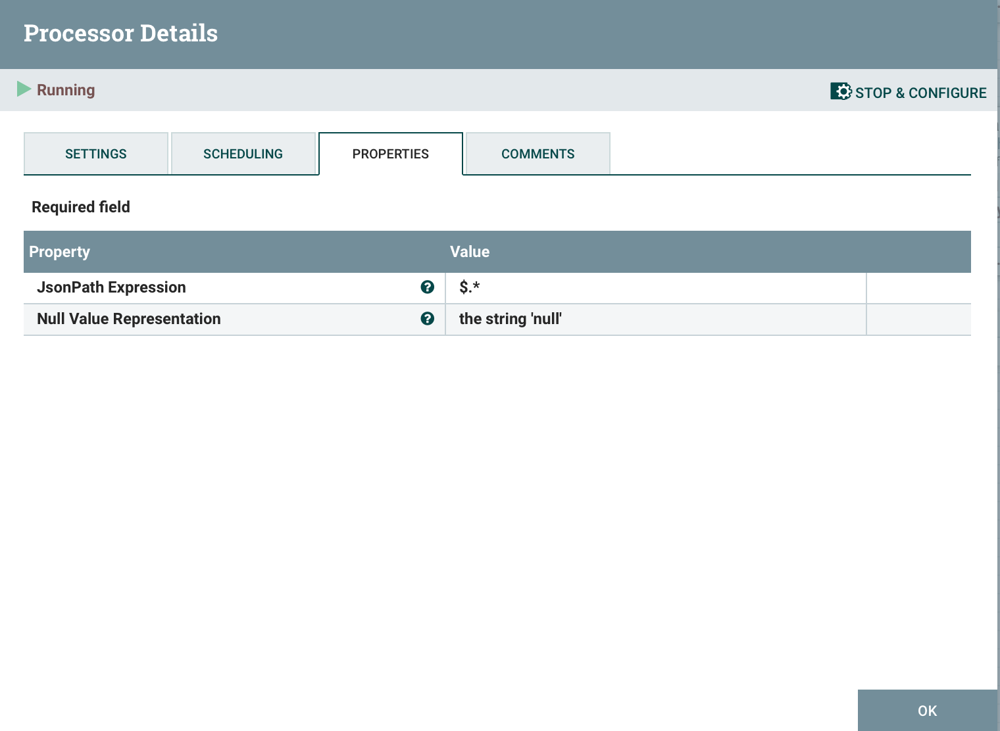

```
PutElasticsearchHttp: Ingest the data into Elasticsearch, choosing an index to be located in.
```
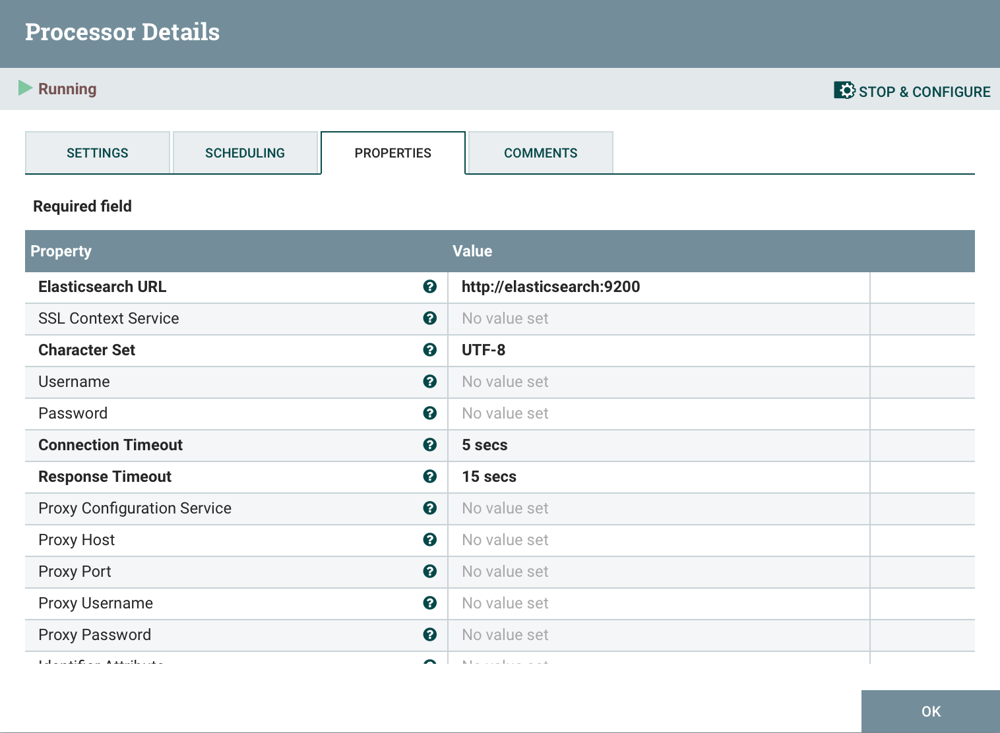
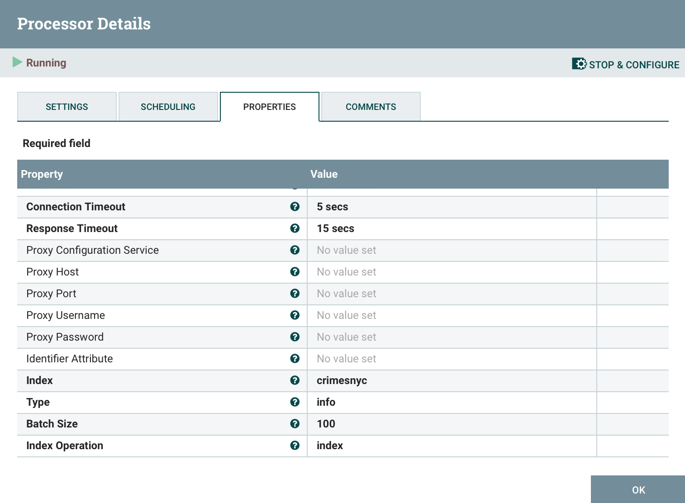

#### Step 3: Run NiFi flow of data.

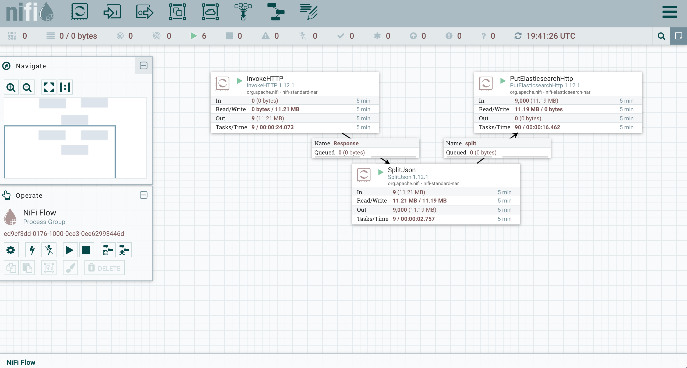

#### Step 4: Check Elasticsearch is running in port 9200 and go to [Elastic_indexes](http://localhost:9200/_cat/indices?v) to check indexes status.

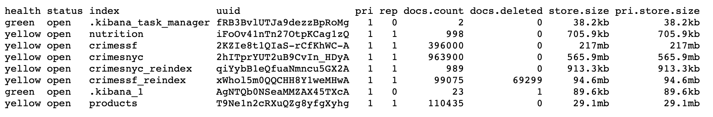

#### Step 5: Go to [Kibana](http://localhost:5601) and 'Create index pattern' in order to visualize the data.

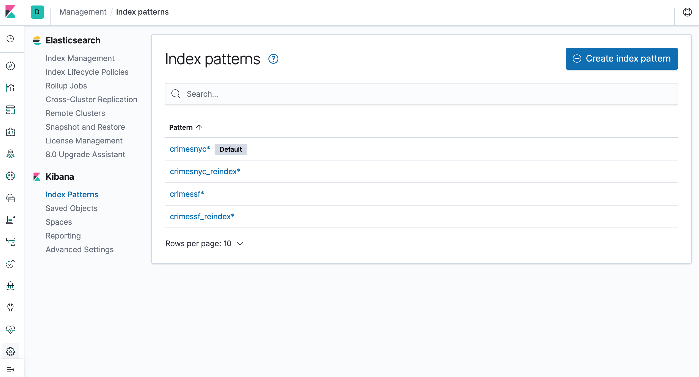

```
As it can be observed, coordinates variables (latitude and longitude) are not 'geo_point' type, but 'string' (it comes directly from NiFi), thus it has to be modified.
```
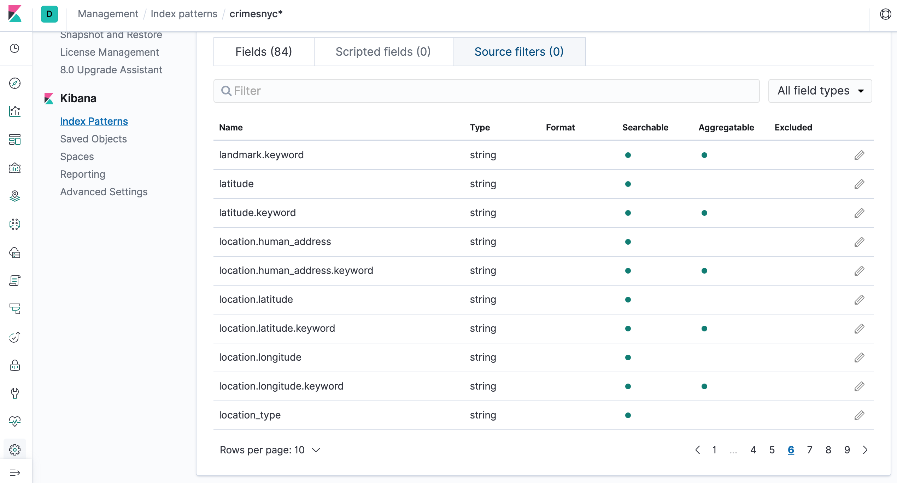

#### Step 6: Go to Kibana console (Dev Tools) and create a new index through Reindex API.

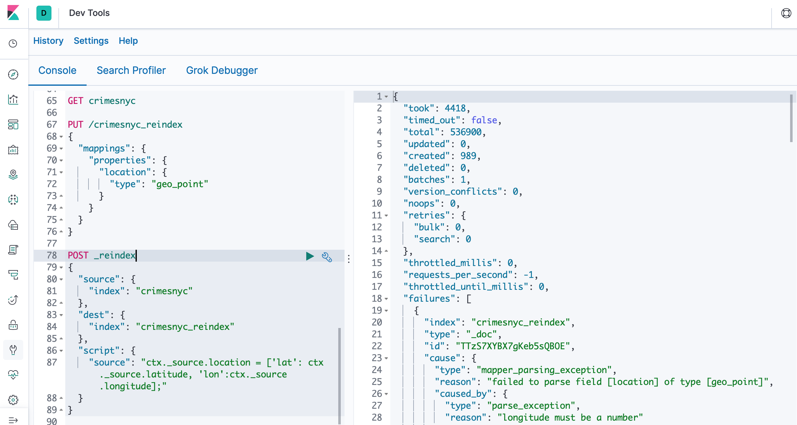

#### Step 7: Now, the new index has the same information, but with a new 'geo_point' type variable (location). 'Create index pattern' again, but with the new one, and check everything is finally correct.

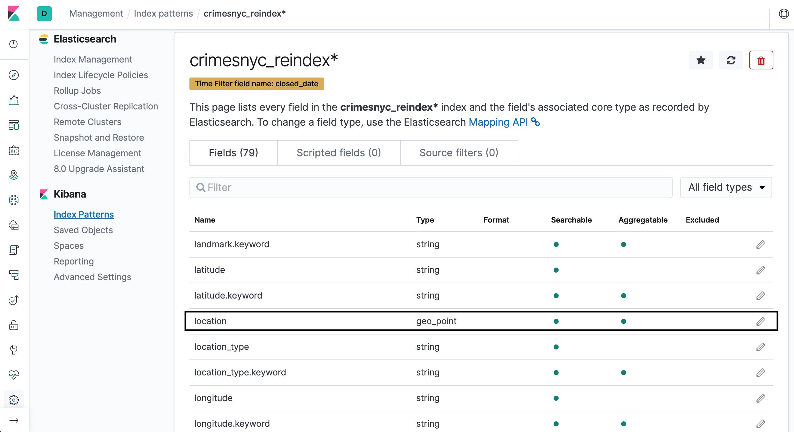

#### Step 8: Visualize the data in a Coordinate Map.

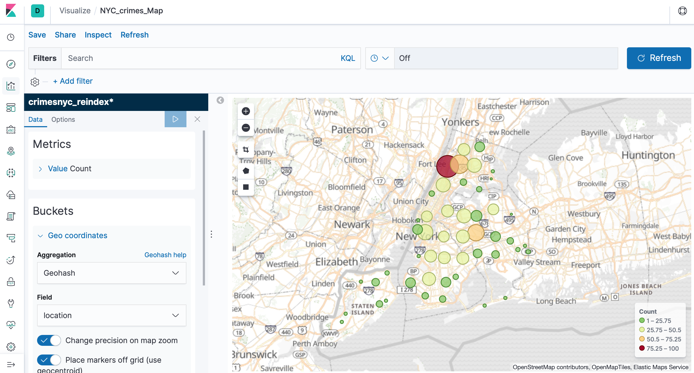

```
There are many ways to print the map (options), such as 'Heatmap', for instance.
```
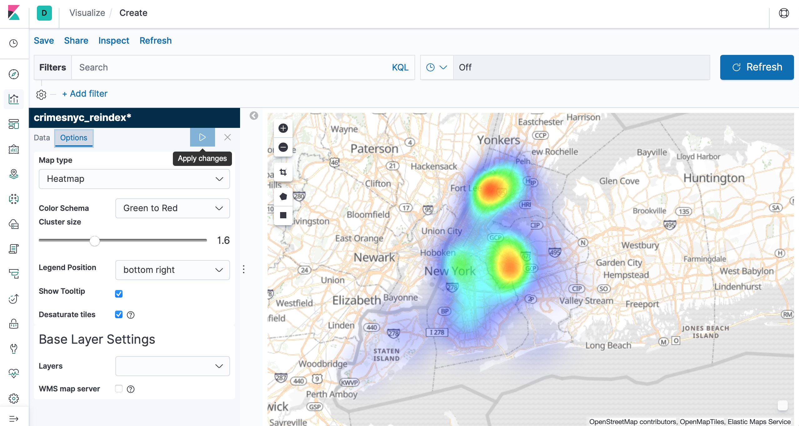

#### Step 9: Other visualizations can be created, like Pie Charts or Bar Charts. Put them all together in a final Dashboard for a better understanding of the situation.

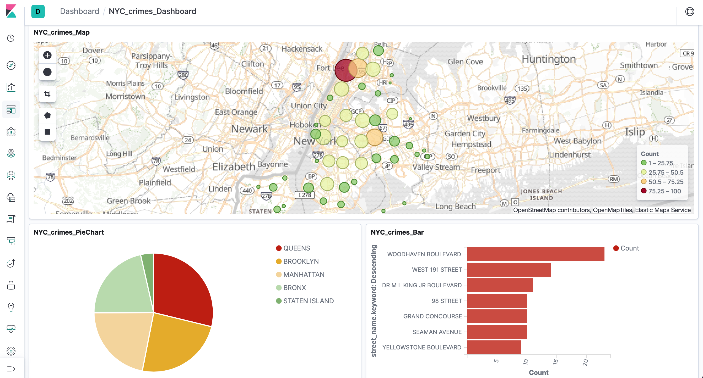

______

### Add more cities to the analysis.

```
You can now add more datasets with a view of having a wide analysis within different cities. Here, San Francisco 311 Service Requests have been added to the original New York City dataset.
```

#### Step 1: Follow the same steps than before. Visualize the data.

###### Source: [San Francisco Data](https://andrew-friedman.github.io/jkan/datasets/311-City-of-San-Francisco/)
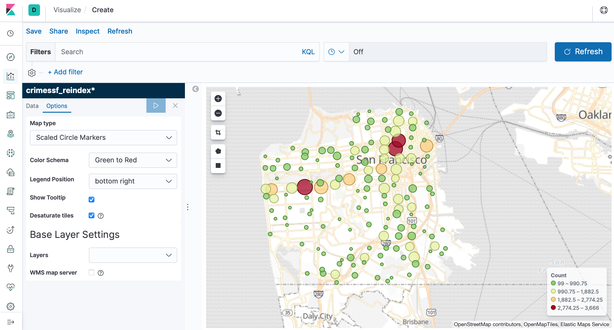

#### Step 2: Join the cities in the same Map for a combined display. Go to Kibana Maps and add a layer for each city, selecting a different index pattern for each dataset.

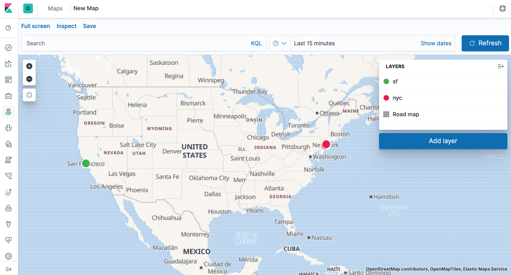

_____
